<div align="center">

# 🚀 Kong Gateway on Kubernetes Engineering Lab

### Production-Oriented API Platform Engineering with Kong, Kubernetes, Go, Lua and AWS Architecture

**Routing · Security · Custom Plugins · High Availability · Observability · APIOps · IaC · CI/CD**

[](https://github.com/merazsheikh/kong-kubernetes-lab/actions/workflows/validate.yml)


</div>

---

## 🎯 Project Overview

This repository is a hands-on **API Platform Engineering lab** built around Kong Gateway and Kubernetes.

Rather than demonstrating only a basic Gateway installation, the project explores the complete API request lifecycle:

```text
Routing
   ↓
Authentication
   ↓
Authorization
   ↓
Rate Limiting
   ↓
Request Validation / Transformation
   ↓
Upstream Routing
   ↓
Observability
   ↓
Troubleshooting
```

The goal is to understand not only **how to configure Kong**, but also how to design, secure, operate and troubleshoot an API platform in a cloud-native environment.

---

## 🏆 What I Built

| Area | Implementation |
|---|---|
| 🚪 API Gateway | Kong Gateway + Kong Ingress Controller |
| 🛣️ Routing | Kubernetes Ingress + Gateway API |
| 🔐 Authentication | JWT + API Key |
| 🛡️ Authorization | Kong Consumers + ACL |
| 🔒 mTLS | Local CA, server and client certificate lab |
| ⚡ Traffic Control | Kong rate limiting |
| 🧩 Custom Plugin | Lua `request-header-validator` using Kong PDK |
| 📦 Gateway Image | Versioned immutable Kong image with custom plugin |
| 🐹 Backend API | Go Orders REST API |
| 📜 API Contract | OpenAPI 3.0 |
| ☸️ Kubernetes | Deployments, Services, probes, resources and security controls |
| 🛡️ High Availability | Multiple Gateway replicas + PDB + health checks |
| 📊 Observability | Prometheus metrics + Kong latency analysis |
| 🔄 APIOps | decK declarative configuration validation |
| 🏗️ Infrastructure | Terraform for Kubernetes + AWS EKS architecture |
| 🚀 CI/CD | GitHub Actions validation + GHCR image publishing |
| 🔥 Troubleshooting | Real routing, security and upstream failure scenarios |

---

## 📚 Contents

- [Architecture](#️-architecture)
- [Tested Behaviour](#-tested-behaviour)
- [Kong Routing](#-kong-routing)
- [API Security](#-api-security)
- [Rate Limiting](#-rate-limiting)
- [Custom Kong Plugin](#-custom-kong-plugin)
- [Immutable Gateway Image](#-immutable-kong-gateway-image)
- [Go Orders API](#-go-orders-api)
- [OpenAPI Contract](#-openapi-contract)
- [Kubernetes Integration](#️-kubernetes-integration)
- [Gateway API](#-gateway-api)
- [High Availability](#️-high-availability)
- [Observability](#-observability)
- [Production Troubleshooting](#-production-troubleshooting)
- [decK and APIOps](#-deck-and-apiops)
- [Terraform and AWS](#️-terraform-and-aws)
- [CI/CD](#-cicd)
- [Lab vs Production](#-lab-vs-production)
- [Repository Structure](#-repository-structure)
- [Key Engineering Lessons](#-key-engineering-lessons)

---

## 🏗️ Architecture

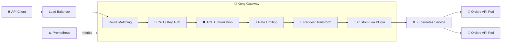

A request typically moves through:

```text
Client
  ↓
Load Balancer
  ↓
Kong Route
  ↓
Authentication
  ↓
Authorization
  ↓
Traffic Policies
  ↓
Request Transformation / Validation
  ↓
Kubernetes Service
  ↓
EndpointSlice
  ↓
Ready Application Pod
```

The production architecture explored in this repository extends this model to multiple Kong Gateway instances, multiple failure domains, external load balancing, health checks, PodDisruptionBudgets and infrastructure managed through code.

---

## 🧪 Tested Behaviour

The lab validates both successful requests and failure conditions.

| Scenario | Observed / Expected Behaviour |
|---|---|
| Request without JWT | `401 Unauthorized` |
| Valid JWT but ACL authorization fails | `403 Forbidden` |
| Required `X-Client-ID` missing | `400 Bad Request` |
| Valid authenticated and authorized request | `200 OK` |
| Rate limit exceeded | `429 Too Many Requests` |
| No available backend Pods | `503 Service Unavailable` |
| Duplicate unsecured Route | Authentication bypass reproduced and diagnosed |
| Public `/orders` request | Transformed to internal `/api/v1/orders` |

These exercises make the repository a troubleshooting lab rather than only a collection of configuration files.

---

## 🛣️ Kong Routing

The lab demonstrates API exposure through both **Kubernetes Ingress** and **Gateway API**.

Example public routes:

```text
/echo
/orders
/gateway-echo
```

Routing exercises cover:

- path matching
- `strip_path`
- request transformation
- Kubernetes Service discovery
- Gateway API `HTTPRoute`
- overlapping route troubleshooting

A useful mental model is:

```text
Route
  ↓
Which incoming request matched?

Service
  ↓
Which API should receive it?

Upstream
  ↓
Which backend pool?

Target
  ↓
Which actual backend instance?
```

---

## 🔐 API Security

Security controls are applied at the Gateway before traffic reaches protected backend APIs.

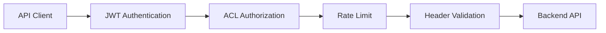

### JWT Authentication

Protected APIs require a valid JWT before traffic reaches the upstream application.

The Gateway is responsible for authenticating the request before allowing it through the security chain.

### API Key Authentication

Kong Consumers and key-auth credentials demonstrate simpler client authentication using API keys.

### ACL Authorization

Authentication and authorization are intentionally separated.

```text
Authentication
"Who are you?"

Authorization
"Are you allowed to access this API?"
```

In the lab:

```text
JWT
  ↓
Authentication
  ↓
ACL
  ↓
Authorization
```

### mTLS

A local certificate lab demonstrates mutual TLS concepts including:

- Certificate Authority
- server certificates
- client certificates
- certificate verification
- inbound mTLS
- upstream mTLS

```text
Inbound mTLS

Client Certificate
       ↓
      Kong


Upstream mTLS

Kong Certificate
       ↓
    Backend
```

Generated certificates and private keys are intentionally excluded from source control.

---

## ⚡ Rate Limiting

Kong's rate-limiting plugin is used to control request volume.

Example lab policy:

```text
5 requests / minute
```

After the limit is exceeded:

```text
HTTP 429 Too Many Requests
```

The lab also explores an important distributed-systems consideration.

With a local rate-limiting strategy:

```text
Kong-1 → Local Counter
Kong-2 → Local Counter
Kong-3 → Local Counter
```

Each Gateway instance maintains its own counter, so production rate-limit strategy must consider the required level of consistency across multiple Data Plane instances.

---

## 🧩 Custom Kong Plugin

A custom Lua plugin named:

```text
request-header-validator
```

was implemented using the **Kong Plugin Development Kit (PDK)**.

The plugin executes during Kong's **access phase** and checks that a required request header exists.

Example:

```text
X-Client-ID
```

Request flow:

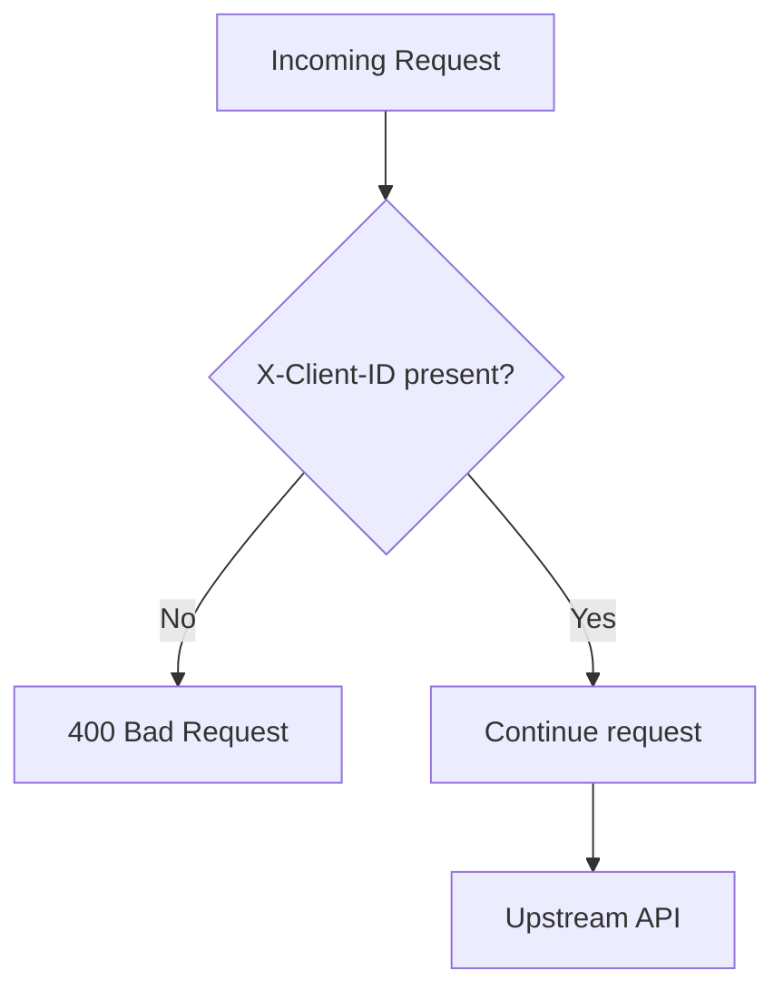

The implementation demonstrates:

- Kong plugin structure
- `handler.lua`
- `schema.lua`
- Kong PDK usage
- access-phase processing
- request validation
- configurable plugin behaviour

The handler contains the runtime behaviour while the schema defines and validates the plugin configuration.

---

## 📦 Immutable Kong Gateway Image

The custom plugin is packaged into a versioned Kong Gateway Docker image rather than relying only on runtime-mounted files.

Example image:

```text
ghcr.io/merazsheikh/kong-request-header-validator:kong-plugin-v1.0.0
```

The deployment pattern is:

```text
Kong Gateway
      +
Custom Lua Plugin
      ↓
Versioned Docker Image
      ↓
GitHub Container Registry
      ↓
Kubernetes
```

This provides a predictable relationship between the Gateway runtime and plugin version across Gateway instances.

---

## 🐹 Go Orders API

A lightweight REST API written in **Go** runs behind Kong.

Consumer-facing endpoint:

```http
GET /orders
```

Internal application endpoint:

```http
GET /api/v1/orders
```

Kong transforms the public URI before proxying the request.

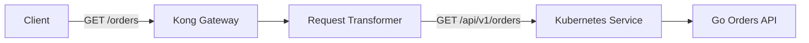

The application also provides:

```http
GET /health
GET /ready
```

for Kubernetes health checks.

Container and deployment practices include:

- multi-stage Docker build
- small runtime image
- non-root numeric UID/GID
- HTTP server timeouts
- Kubernetes readiness checks
- Kubernetes liveness checks
- CPU/memory requests
- CPU/memory limits
- restricted container privileges

---

## 📜 OpenAPI Contract

The consumer-facing Orders API is documented using **OpenAPI 3.0**.

```text
openapi/orders-api.yaml
```

The contract documents:

- `/orders`
- JWT bearer authentication
- response schemas
- health endpoints
- Gateway/API error responses

An important design principle demonstrated here is:

```text
Public API Contract
        ≠
Internal Application URI
```

Consumers use:

```text
/orders
```

while the application can internally use:

```text
/api/v1/orders
```

Kong provides the abstraction between them.

---

## ☸️ Kubernetes Integration

The repository includes examples of:

- Deployments
- Services
- Ingress
- Gateway API
- readiness probes
- liveness probes
- resource requests and limits
- non-root containers
- PodDisruptionBudgets
- EndpointSlice troubleshooting

The upstream networking path is:

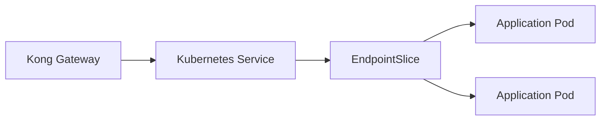

This path is particularly important when diagnosing `502`, `503` and timeout errors.

---

## 🚪 Gateway API

The project demonstrates both traditional Kubernetes Ingress and the newer **Gateway API** model.

Resources include:

```text
GatewayClass
Gateway
HTTPRoute
```

Conceptually:

```text
GatewayClass
     ↓
Gateway
     ↓
HTTPRoute
     ↓
Kubernetes Service
```

This provides practical experience with both Kubernetes routing models supported by Kong.

---

## 🛡️ High Availability

The HA exercises explore running multiple Kong Gateway instances.

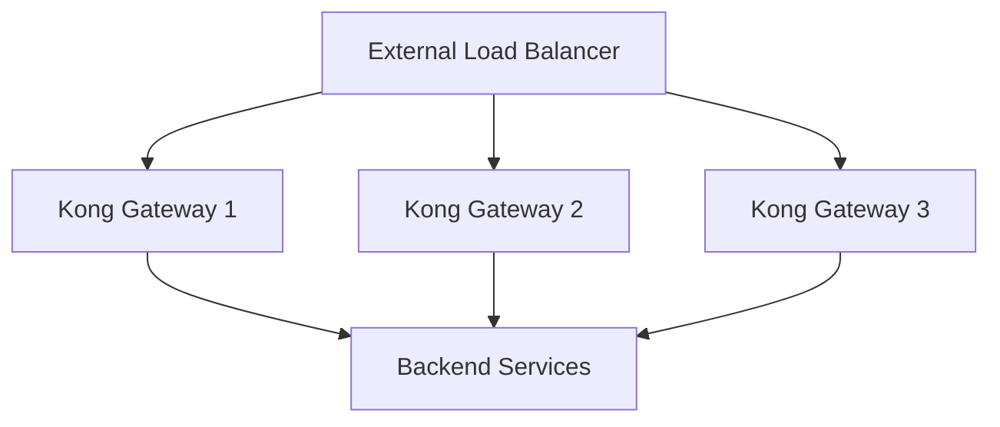

Production considerations documented include:

- multiple Gateway replicas
- multiple Kubernetes nodes
- multi-AZ architecture
- readiness probes
- liveness probes
- PodDisruptionBudgets
- rolling deployments
- Data Plane resilience
- Control Plane / Data Plane separation

High availability is treated as a **failure-domain problem**, not simply a replica-count problem.

```text
Process failure
     ↓
Pod failure
     ↓
Node failure
     ↓
Availability Zone failure
     ↓
Regional failure
```

Three Pods running on one machine do not provide the same resilience as three Pods distributed across independent infrastructure.

### Hybrid Architecture

The repository also explores Kong's Control Plane / Data Plane architecture.

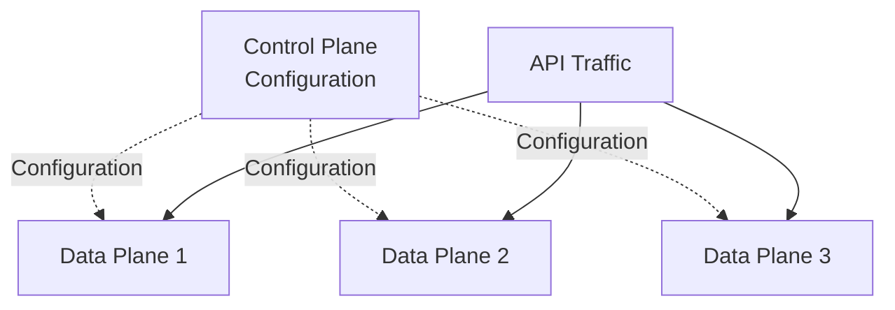

Existing Data Planes can continue serving previously received configuration during temporary Control Plane connectivity loss.

---

## 📊 Observability

Kong's Prometheus plugin is used to expose Gateway metrics.

Enabled metric categories include:

```text
Status code metrics
Latency metrics
Bandwidth metrics
```

Useful examples include:

```text
http_requests_total
kong_request_latency_ms
kong_upstream_latency_ms
kong_kong_latency_ms
```

The key operational question is often:

```text
Is Kong slow?

        OR

Is the backend slow?
```

Useful Kong response headers include:

```text
X-Kong-Proxy-Latency
X-Kong-Upstream-Latency
X-Kong-Response-Latency
X-Kong-Request-Id
```

A request ID can be used to correlate:

```text
Client Error
    ↓
Request ID
    ↓
Kong Logs
    ↓
Application Logs
    ↓
Distributed Trace
```

A production monitoring architecture could extend this to:

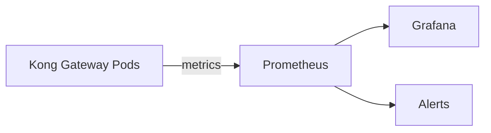

---

## 🔥 Production Troubleshooting

The project intentionally creates failure scenarios instead of testing only successful requests.

### Scenario 1 — Duplicate Route Security Bypass

A protected `/echo` API was expected to reject requests without authentication.

Expected:

```text
401 Unauthorized
```

Observed:

```text
200 OK
```

The investigation discovered another Kubernetes Ingress exposing the same path without the required security plugins.

```text
Expected 401
     ↓
Received 200
     ↓
Verify actual Kong Route
     ↓
Found overlapping Ingress
     ↓
Removed obsolete route
     ↓
Security restored
```

After correction:

```text
No JWT
   ↓
401

Valid JWT but unauthorized
   ↓
403

Missing required header
   ↓
400

Valid authorized request
   ↓
200
```

**Engineering lesson:** verify the actual Route handling the request before assuming an authentication plugin has failed.

---

### Scenario 2 — No Available Upstream

The Orders API was deliberately scaled to zero replicas.

Kong returned:

```text
HTTP 503 Service Unavailable
```

with:

```text
failure to get a peer from the ring-balancer
```

Investigation path:

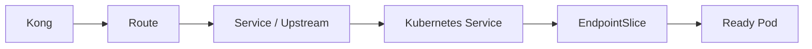

The exercise demonstrates that:

> A healthy Kong Gateway does not automatically mean its upstream API is healthy.

---

### Troubleshooting Model

A reusable production investigation sequence is:

```text
1. Can the client reach Kong?
              ↓
2. Did Kong match the expected Route?
              ↓
3. Did authentication succeed?
              ↓
4. Did authorization succeed?
              ↓
5. Which Service / Upstream was selected?
              ↓
6. Does the Kubernetes Service exist?
              ↓
7. Are EndpointSlices populated?
              ↓
8. Are backend Pods Ready?
              ↓
9. Can Kong reach the backend?
              ↓
10. What do Gateway/application logs show?
              ↓
11. Where is latency occurring?
```

This is preferable to immediately restarting components.

---

## 🔄 decK and APIOps

Declarative Kong configuration is maintained under:

```text
deck/
```

decK is used for offline configuration validation in the current Kubernetes/KIC DB-less lab.

Example:

```bash
deck file validate deck/kong.yaml
```

A typical APIOps workflow for an appropriate Gateway deployment would be:

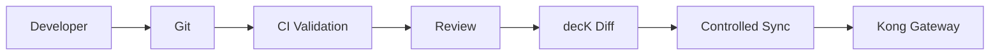

The project deliberately separates configuration ownership.

```text
Kubernetes resources
        ↓
       KIC

Declarative Gateway configuration
        ↓
    decK / APIOps
```

The same runtime entities should not be independently controlled by multiple configuration systems.

---

## 🏗️ Terraform and AWS

Terraform examples cover two areas.

### Local Kubernetes

Terraform manages example Kubernetes resources in the local lab.

### AWS EKS Architecture

The AWS architecture contains definitions and examples covering:

- VPC
- public/private subnet design
- Amazon EKS
- managed node groups
- multiple Kong replicas
- AWS Network Load Balancer pattern
- PodDisruptionBudget

Conceptual production architecture:

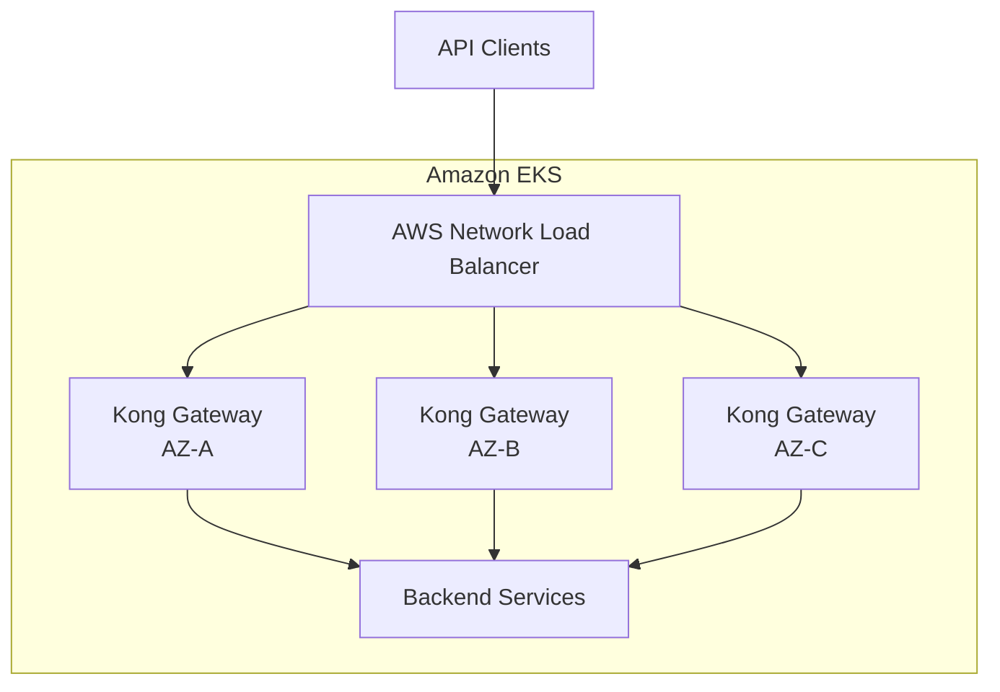

The AWS configuration in this repository is **architecture and validation focused** and is not presented as a complete live AWS production environment.

---

## 🚀 CI/CD

GitHub Actions automatically validates the repository.

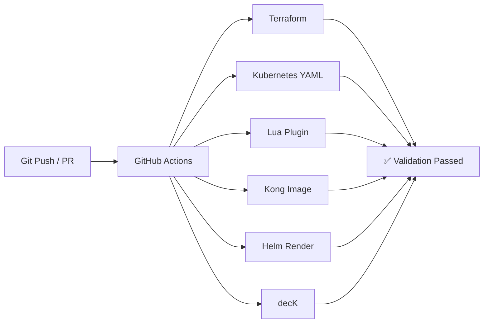

Current validation includes:

- Terraform formatting and validation
- Kubernetes/Kong YAML parsing
- Lua plugin syntax checks
- custom Kong image build
- plugin installation checks
- Helm rendering
- decK declarative configuration validation

A separate workflow publishes the versioned custom Kong image to **GitHub Container Registry** when a release tag is created.

Example:

```text
kong-plugin-v1.0.0
```

---

## 🌍 Lab vs Production

The repository clearly separates what was implemented in the local engineering lab from how the same concepts would be extended in production.

| Area | Engineering Lab | Production Direction |
|---|---|---|
| Kubernetes | kind | EKS / managed Kubernetes |
| Kong | Multi-pod Gateway exercises | Multi-node, multi-AZ Gateway |
| Routing | Ingress + Gateway API | Controlled enterprise routing |
| Identity | JWT + API keys | Enterprise IdP / OIDC |
| Authorization | ACL | Policy/scopes/claims as required |
| mTLS | Local PKI exercise | Managed enterprise PKI lifecycle |
| Rate Limiting | Local policy | Distributed strategy based on requirements |
| Monitoring | Prometheus plugin | Central Prometheus/Grafana/observability |
| AWS | Terraform architecture | Complete AWS landing zone |
| Configuration | KIC + decK exercises | Explicit configuration ownership |
| CI/CD | GitHub Actions | Environment promotion + approvals |
| Secrets | Lab credentials excluded from Git | Managed secrets platform |
| HA | Pod-level exercises | Node/AZ/region failure-domain design |

---

## 📁 Repository Structure

```text
.
├── .github/
│   └── workflows/
│
├── apps/
│   └── orders-api/
│
├── deck/
│   └── kong.yaml
│
├── docs/
│   ├── security/
│   ├── troubleshooting
│   ├── high availability
│   ├── observability
│   └── APIOps
│
├── kong/
│   ├── consumers/
│   ├── custom-plugins/
│   ├── gateway-api/
│   ├── observability/
│   └── plugins/
│
├── kubernetes/
│   ├── apps/
│   ├── aws-eks/
│   ├── deployments/
│   ├── ha/
│   ├── ingress/
│   ├── namespaces/
│   └── services/
│
├── openapi/
│   └── orders-api.yaml
│
├── scripts/
│
└── terraform/
    ├── aws-eks/
    └── kubernetes/
```

---

## 🧠 Key Engineering Lessons

This project focuses on operational understanding rather than only configuration.

### Routing

- Kong Route selection should be verified before assuming a plugin has failed.
- `strip_path` and request transformation directly affect upstream URI behaviour.
- Public API contracts do not have to expose internal application paths.

### Security

- Authentication and authorization are separate concerns.
- A valid JWT does not automatically mean a client is authorized.
- Security policies should be enforced consistently across every applicable Route.
- Private keys and generated certificates should never be committed to source control.

### Kubernetes

- Kubernetes Services depend on healthy/ready endpoints.
- A healthy Gateway does not guarantee a healthy backend.
- EndpointSlices are an important part of upstream troubleshooting.
- Readiness determines whether a Pod should receive traffic.
- Liveness determines whether Kubernetes should restart a failing container.

### Reliability

- A Kong `503` can indicate that no usable upstream peer is available.
- `502`, `503` and `504` represent different failure modes.
- API retries must consider HTTP method idempotency.
- High availability requires independent failure domains, not simply more replicas.
- PodDisruptionBudgets protect against supported voluntary disruptions, not every infrastructure failure.

### Kong Platform Engineering

- Custom plugins should be distributed consistently across every Gateway instance.
- Immutable Gateway images provide predictable custom-plugin deployment.
- Local rate-limit counters have implications for horizontally scaled Gateways.
- Configuration ownership should not overlap between KIC, decK, Terraform and manual changes.
- Data Planes can continue serving previously received configuration during temporary Control Plane connectivity loss.

### Operations

- Observability should distinguish Gateway latency from upstream latency.
- Request IDs provide a useful correlation point across Gateway and application logs.
- Metrics, logs and traces should be used together.
- Troubleshooting should follow the request path rather than start with random component restarts.

---

## 📖 Detailed Engineering Notes

Additional technical notes are available in the repository:

- `docs/01-kubernetes-fundamentals.md`
- `docs/07-troubleshooting.md`
- `docs/08-kong-production-ha.md`
- `docs/09-kong-ha-lab.md`
- `docs/10-kong-observability.md`
- `docs/11-deck-apiops.md`
- `docs/security/01-api-authentication.md`

These documents contain deeper explanations of the experiments, architecture and troubleshooting exercises represented by the repository.

---

## ✅ Project Status

### Core Engineering Lab Complete

The repository currently demonstrates:

**Kong Gateway · Kubernetes · API Security · Lua Plugins · Go APIs · OpenAPI · Gateway API · High Availability · Observability · decK/APIOps · Terraform · AWS EKS Architecture · CI/CD · Production Troubleshooting**

The environment remains available for continued API platform engineering experiments.

---

<div align="center">

### Kong API Platform Engineering Lab

**Built to learn the platform by deploying it, securing it, breaking it and troubleshooting it.**

</div>
