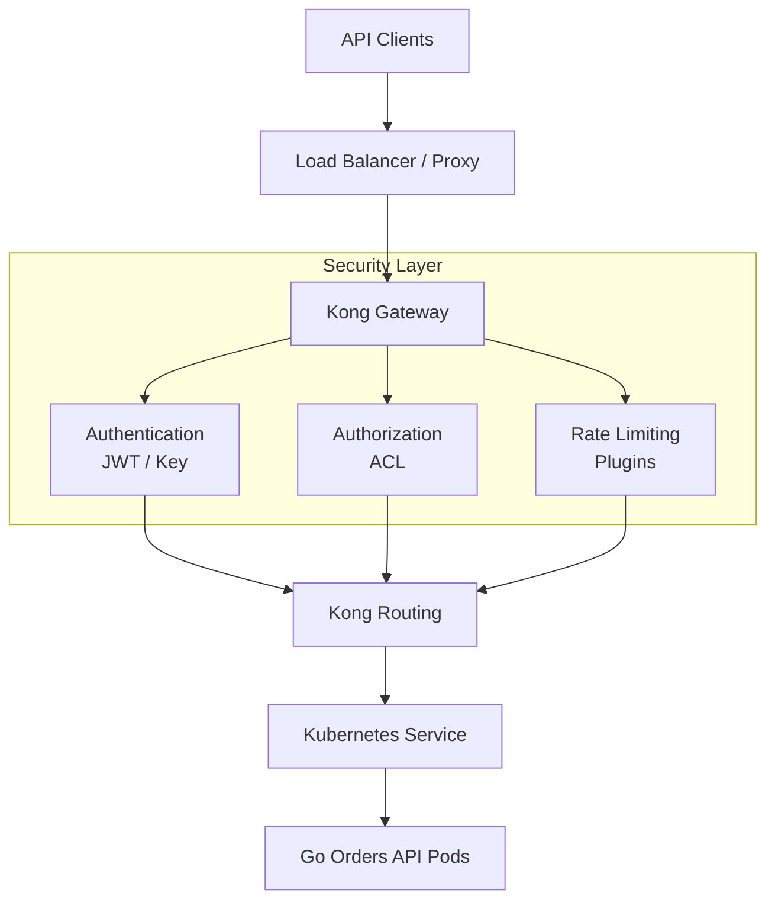
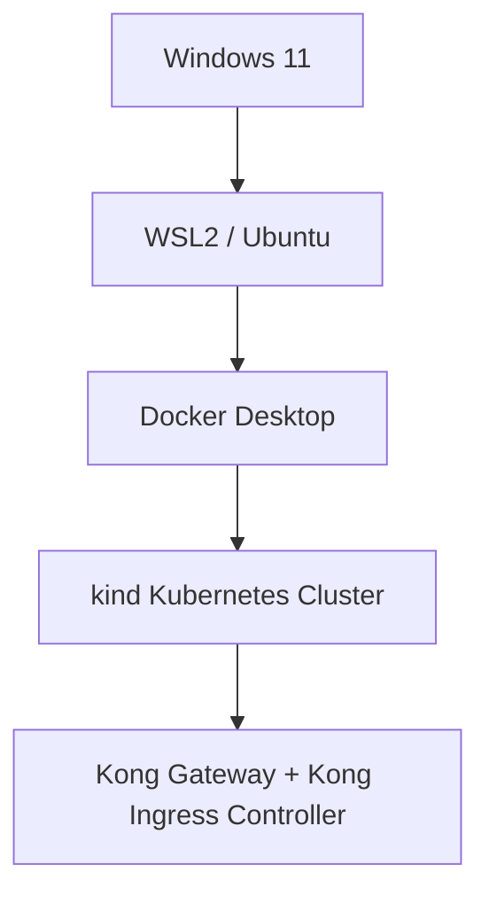
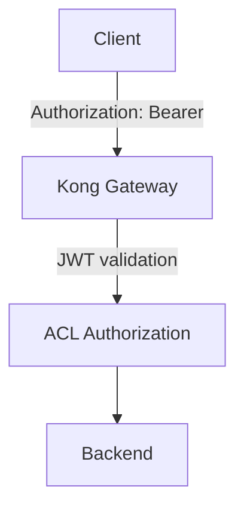
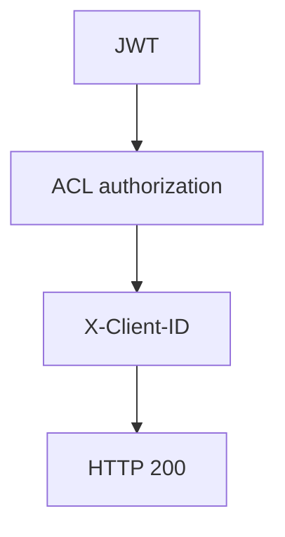
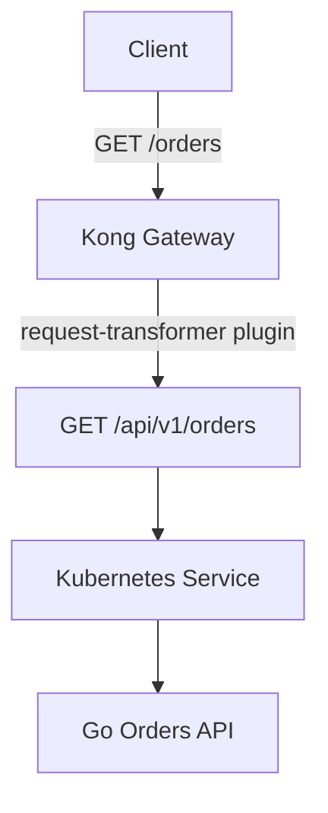
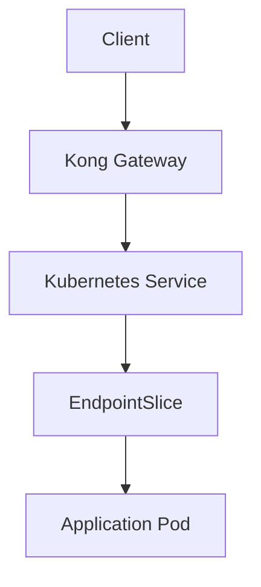
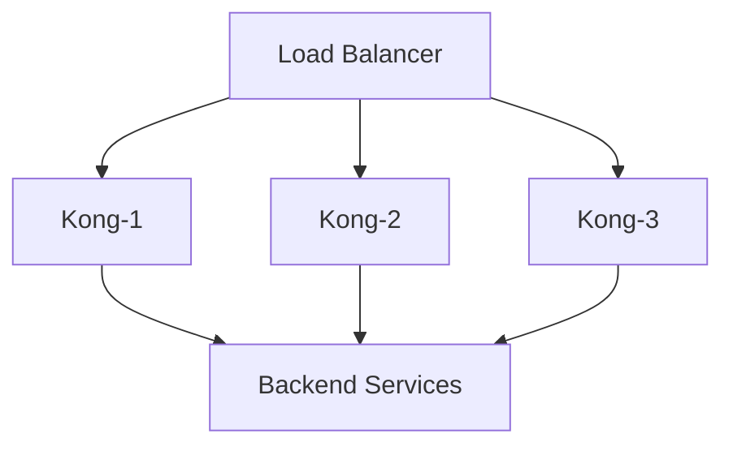
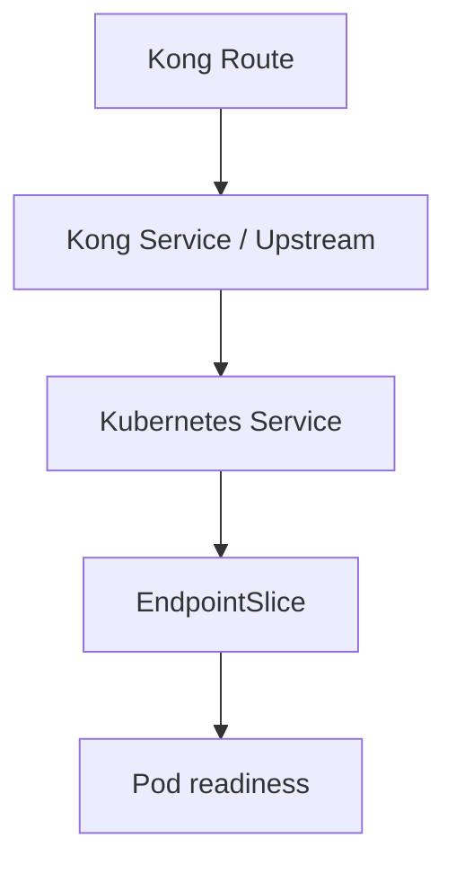

# Kong Gateway on Kubernetes Engineering Lab

[](https://github.com/merazsheikh/kong-kubernetes-lab/actions)

Hands-on API platform engineering project demonstrating Kong Gateway deployment, API security, Kubernetes integration, custom plugin development, observability, infrastructure as code, CI/CD, and production troubleshooting.

The project was built as a practical environment for understanding how Kong operates in cloud-native API platforms rather than as a simple installation demo.

## Architecture



The production architecture explored in the repository extends this model to multiple Kong Gateway instances across availability zones with Kubernetes health checks, PodDisruptionBudgets, external load balancing, observability, and infrastructure managed through code.

---

## Technologies

- Kong Gateway
- Kong Ingress Controller
- Kubernetes
- Gateway API
- Docker
- kind
- Helm
- Go
- Lua
- OpenAPI
- decK
- Terraform
- AWS EKS architecture
- GitHub Actions
- Prometheus

Development environment:



---

## Kong Gateway Capabilities Demonstrated

### Routing

The lab demonstrates API exposure through both Kubernetes Ingress and Gateway API.

Examples include:

```text
/echo
/orders
/gateway-echo
```

Routing exercises cover:

- path matching
- `strip_path`
- request transformation
- Kubernetes Service discovery
- Gateway API `HTTPRoute`
- overlapping route troubleshooting

---

## API Security

Several Kong authentication and authorization mechanisms are demonstrated.

### JWT Authentication

Requests to protected APIs require a valid JWT before traffic reaches the upstream service.



### API Key Authentication

Kong Consumers and key-auth credentials are used to demonstrate API client authentication.

### ACL Authorization

Authentication and authorization are intentionally separated.

- **JWT** -> Who is the client?
- **ACL** -> Is the client allowed to access this API?

### mTLS

A local certificate lab demonstrates mutual TLS concepts including:
- Certificate Authority
- server certificates
- client certificates
- client certificate verification
- inbound versus upstream mTLS

Generated certificates and private keys are intentionally excluded from source control.

---

## Rate Limiting

The project uses Kong's rate-limiting plugin to enforce API request limits.

Example lab policy:
`5 requests / minute`

The lab also documents why the local policy requires consideration when multiple Kong Data Plane instances are running, since counters are local to individual Gateway instances.

---

## Custom Kong Plugin

A custom Lua plugin called:
`request-header-validator`
was implemented using the Kong Plugin Development Kit.

The plugin executes during Kong's access phase and validates that a required request header exists.

Example:
`X-Client-ID`

Missing header:
`HTTP 400 Bad Request`

Valid request:



The plugin demonstrates:
- Kong plugin structure
- `handler.lua`
- `schema.lua`
- Kong PDK usage
- access-phase request validation
- configurable plugin behaviour

---

## Immutable Kong Gateway Image

The custom plugin is packaged into a versioned Kong Gateway Docker image rather than depending only on runtime-mounted plugin files.

Example image:
`ghcr.io/merazsheikh/kong-request-header-validator:kong-plugin-v1.0.0`

This demonstrates a production-oriented deployment pattern where the Gateway runtime and custom plugin version are deployed together as an immutable artifact.

---

## Go Orders API

A lightweight REST API written in Go is deployed behind Kong.

Public API:
`GET /orders`

Internal application endpoint:
`GET /api/v1/orders`

Kong transforms the public route before proxying the request to the application.



The application also exposes:
`GET /health`
`GET /ready`
for Kubernetes liveness and readiness probes.

The container runs using a non-root numeric UID/GID and Kubernetes security controls.

---

## OpenAPI Contract

The consumer-facing Orders API is documented using OpenAPI 3.0.
`openapi/orders-api.yaml`

The contract documents:
- `/orders`
- JWT bearer authentication
- response schemas
- health endpoints
- common Gateway/API error responses

This intentionally describes the public API exposed by Kong rather than the application's internal URI.

---

## Kubernetes Integration

The repository includes examples of:
- Deployments
- Services
- Ingress
- Gateway API
- readiness probes
- liveness probes
- resource requests and limits
- non-root containers
- PodDisruptionBudgets
- EndpointSlice troubleshooting

Example request path:



---

## Gateway API

The project also demonstrates Kubernetes Gateway API resources:
- `GatewayClass`
- `Gateway`
- `HTTPRoute`

This provides experience with both traditional Kubernetes Ingress and the newer Gateway API model.

---

## High Availability

The HA exercises explore running multiple Kong Gateway instances behind a Kubernetes Service.



Production considerations documented include:
- multiple Gateway replicas
- multi-AZ deployment
- readiness and liveness probes
- PodDisruptionBudgets
- rolling deployments
- Data Plane resilience
- Control Plane / Data Plane separation

The repository also discusses Kong hybrid architecture where Data Planes continue serving previously received configuration during temporary Control Plane connectivity loss.

---

## Observability

Kong's Prometheus plugin is used to expose Gateway metrics.

The observability exercises focus on distinguishing Gateway latency from upstream application latency.

Useful Kong response headers include:
- `X-Kong-Proxy-Latency`
- `X-Kong-Upstream-Latency`
- `X-Kong-Request-Id`

This allows troubleshooting to distinguish:
`Gateway problem vs Backend problem`

---

## Production Troubleshooting

The project intentionally includes failure scenarios rather than only successful deployments.

### Duplicate Route Security Bypass

An unprotected Ingress exposed the same `/echo` path as a protected route.

Result:
Expected: 401
Observed: 200

The investigation identified overlapping Kubernetes Ingress resources.

The obsolete route was removed and the expected security chain was restored:
- No JWT -> 401
- Valid JWT, unauthorized -> 403
- Missing required header -> 400
- Valid authorized request -> 200

### No Available Upstream

The Orders API was deliberately scaled to zero replicas.

Kong returned:
`HTTP 503`
`failure to get a peer from the ring-balancer`

The troubleshooting path was:



This demonstrates the importance of identifying whether an error originates from Kong or from the upstream application.

---

## decK and APIOps

A declarative Kong configuration is maintained under:
`deck/`

decK is used for offline configuration validation in CI.

The lab intentionally separates ownership models:
- Kubernetes resources -> Kong Ingress Controller
- Declarative Gateway configuration -> decK / APIOps

The same runtime entities should not be independently managed by multiple configuration systems.

---

## Terraform

Terraform examples cover two areas.

### Local Kubernetes

Terraform manages Kubernetes resources in the local lab environment.

### AWS EKS Architecture

The AWS example contains infrastructure definitions for:
- VPC
- public/private subnet architecture
- Amazon EKS
- managed node groups
- Kong deployment architecture

The AWS configuration is architecture and validation focused and is not applied to a live AWS account by this repository.

---

## CI/CD

GitHub Actions validates the repository automatically.

Current validation includes:
- Kubernetes YAML
- Terraform
- decK configuration
- Custom Kong Lua plugin
- Custom Kong Gateway Docker image

A separate workflow publishes the versioned Kong custom-plugin image to GitHub Container Registry when a release tag is created.

Example:
`kong-plugin-v1.0.0`

---

## Repository Structure

```text
.
├── apps/
│   └── orders-api/
│
├── deck/
│   └── kong.yaml
│
├── docs/
│   ├── security/
│   └── troubleshooting and architecture notes
│
├── kong/
│   ├── consumers/
│   ├── custom-plugins/
│   ├── gateway-api/
│   ├── observability/
│   └── plugins/
│
├── kubernetes/
│   ├── apps/
│   ├── aws-eks/
│   ├── deployments/
│   ├── ha/
│   ├── ingress/
│   ├── namespaces/
│   └── services/
│
├── openapi/
│   └── orders-api.yaml
│
├── scripts/
│
└── terraform/
    ├── aws-eks/
    └── kubernetes/
```

---

## Key Engineering Lessons

This project focuses on operational understanding as much as configuration.

Important lessons include:
- Kong Route selection must be verified before assuming a plugin has failed.
- Authentication and authorization are separate concerns.
- A valid JWT does not automatically mean a client is authorized.
- Kubernetes Services only route traffic to ready endpoints.
- A Kong 503 can indicate that no usable upstream peer is available.
- `strip_path` and request transformation directly affect upstream URI behaviour.
- API retries must consider HTTP method idempotency.
- Local rate-limit counters have implications for horizontally scaled Gateways.
- Custom plugins should be distributed consistently across every Gateway instance.
- Immutable Gateway images provide predictable custom-plugin deployments.
- Configuration ownership should not overlap between KIC, decK, Terraform, and manual changes.
- Observability should separate Gateway latency from upstream latency.
- High availability requires more than increasing replica count.

---

## Project Status

*Core lab complete.*

The repository represents a working Kong API engineering environment covering Gateway configuration, Kubernetes integration, API security, custom plugin development, Go API deployment, APIOps, infrastructure as code, CI/CD, observability, high availability, and production troubleshooting.

The environment remains available for continued API platform engineering experiments.
